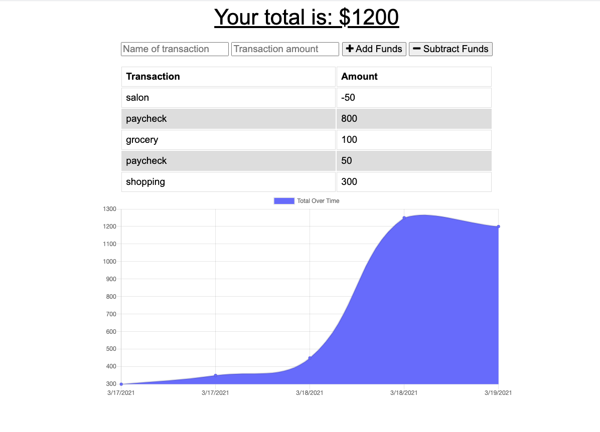
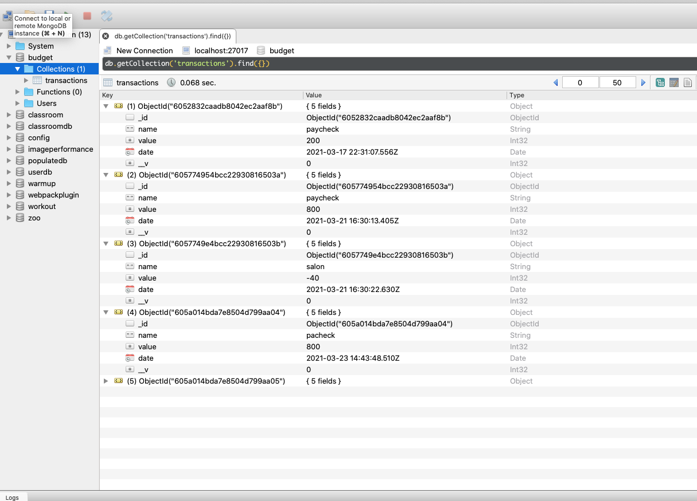

# Budget-Tracker
 ## Table of Contents
  * [Description](#description)
  * [Installation](#installation)
  * [Usage](#usage)
  * [License](#license)
  * [Contributors](#contributors)
  * [Test](#test)
  * [Questions](#questions)
  
  ## Description
  AS AN avid traveller
  I WANT to be able to track my withdrawals and deposits with or without a data/internet connection

  ## Installation
  SO THAT my account balance is accurate when I am traveling
  Utilizing this app, the user will be able to add expenses and deposits to their budget with or without a connection. When entering transactions offline, they should populate the total when brought back online.
  Offline Functionality:

  Enter deposits offline

  Enter expenses offline

  When brought back online:

  Offline entries should be added to tracker.

  ## Usage
     
 * Enter the name and amount for your transaction.   cahrt
 * Select whether you are adding or subtracting funds, via the buttons on the right of the form div.
 * Analyze the graph to see the budget data.
 * Extra: Open Dev Tools and navigate to the Network and Application tabs to see the insight of your data being called. Additionally, you can set your Network and service worker to offline to see the appliction working without internet access.

  ## Lincense
  

  ## Contributors
  n/a

  ## Test
   Open in localhost:3004 and also run node server.js and final deplay to heroku.        
  
  ## Questions

  Contact me:   
  Github: https://github.com/Wendyf02/Budget-Tracker          
  Email: cammomila444@gmail.com          
  Heroku Deploy:https://radiant-mountain-36273.herokuapp.com/

       
      

  